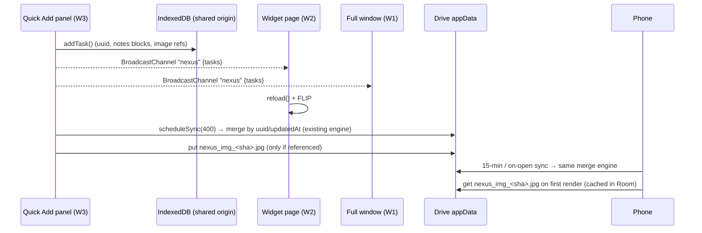

# Nexus 4.0 — Premium Desk & app-wide polish: architecture

Status: design → implementation (this document is the spec every workstream follows).
Version stays **4.0** on web and Android (no bump). Everything stays free: no paid services,
no Apple developer account (the Desk remains an unsigned `osacompile` applet).

## 0. What the user asked for (interpreted)

| # | Ask (dictated) | Reading |
|---|---|---|
| 1 | "Why point the Mac app at the web? Make it a full-fledged app." | The Desk gets a **full Nexus window inside the Desk app** (same WebKit data store → same sign-in, same IndexedDB, same Drive sync). "Open full Nexus" no longer leaves for the browser. Settings, imports, linked sheets/calendars, Scan to set up: all inside. Windows Desk: the full app opens as a browser app-window (already how the widget works there). |
| 2 | "Remove the *Add to High…* tag and give the same *press Enter* prompt as the web app." | The widget's always-visible add bar becomes the web app's keyboard flow: **⏎ → choose priority → type → ⏎**, with `kbd` hints. |
| 3 | "We can press that secret key and change it, not force that key." | The global shortcut is **user-configurable** (record a shortcut) on Mac and Windows, editable from the Desk menu *and* from Nexus Settings. |
| 4 | "Quick add should be a different, very cool, well-animated window in the centre, coming from the bottom right." | A dedicated **Quick Add panel**: Spotlight-style, centred, vibrancy, opens from the shortcut with a spring that originates at the hot corner side, Esc / click-outside closes. Option: shortcut opens the panel (default) or the widget. |
| 5 | "Paste images. Auto-detect list, checklist. `1.` then `2.` on the next line. Backspace turns it back. Mid-text `1.` becomes a list without jumping to the bottom." | Notes editor: **prefix auto-detect in place**, Enter continues, Enter on empty exits, Backspace at start reverts, mid-block conversion, list-like paste → items. **Image blocks** (pasted or picked), synced through Drive app-data. Web + Android. |
| 6 | "Don't show everything in one place in the settings; proper sections." | Settings re-sectioned with a new **Nexus Desk** category and calmer top page. Web + Android. |
| 7 | "Integrate the sheets; it failed for org permission. Scan on the phone → everything comes, live sync of next dates." | **Org-restricted Google Sheets** readable after a one-time Google Picker grant (`drive.file`, non-sensitive scope); **linked sheets sync through Drive** like linked calendars (not only through the QR); new rows keep flowing on every device. |
| 8 | "Notifications handled really well, few options from there." | Mac notifications get **Done / Snooze / Open** buttons; category registered with the user's snooze length; taps open the task in the Desk's full window. |
| 9 | "Bug: opened row moves to another priority, the view doesn't follow." | The expanded row **follows its move** (FLIP + scrollIntoView) in the widget; same rule in the full-screen quadrant. |
| 10 | "Smooth animations for everything, so good people copy it." | A **motion system**: spring `linear()` easings, shared tokens, applied to sheets, rows, checkboxes, tabs, quick add, panel. Reduced-motion respected. |
| 11 | "Whatever a productive person wants is there." | Implemented now: quick add from any app with clipboard paste, image notes, snooze/done from the banner, "Add to Nexus" in the Mac Services menu (select text in any app → task), Dock menu (New task, Show Nexus, Calendar), `nexus://add?text=` URL scheme. Future list at the end. |

## 1. High-level design

```mermaid
flowchart LR
  subgraph Phone["Android app (Kotlin/Compose)"]
    A1[Matrix / Calendar / Notes]
    A2[Reminders · WorkManager]
    A3[Linked sheets & calendars]
  end
  subgraph Web["Web PWA (Preact + signals)"]
    W1[Full app  /]
    W2[Widget page  ?mode=widget]
    W3[Quick Add page  ?mode=quickadd]
    W4[Service worker · push]
  end
  subgraph Desk["Nexus Desk for Mac (JXA + AppKit + WKWebView)"]
    D0[(Shared WKWebsiteDataStore\nIndexedDB · cookies · CryptoKey master key file)]
    D1[Widget panel  → W2]
    D2[Full window  → W1]
    D3[Quick Add panel  → W3]
    D4[Calendar panel  → W2&view=calendar]
    D5[Menu bar · Dock menu · Services · nexus:// · global hot key]
    D6[UNUserNotificationCenter\nDone / Snooze / Open]
    D1 & D2 & D3 & D4 --- D0
  end
  subgraph Win["Nexus Desk for Windows (PowerShell + WinForms)"]
    X1[Tray · hot key · hot corner]
    X2[Browser --app windows: widget, full, quick add]
  end
  subgraph Google["Google (free tier)"]
    G1[(Drive appDataFolder\nnexus_backup.json · nexus_linked_calendars.json\nnexus_linked_sheets.json · nexus_img_*.jpg)]
    G2[Sheets API v4 (drive.file grant via Picker)]
    G3[Calendar / iCloud / Outlook ICS]
  end
  subgraph CF["Cloudflare Worker (free)"]
    C1[Push relay · pairing blobs · ICS proxy · calendar feed]
  end
  Phone <--> G1
  Web <--> G1
  Desk --> Web
  Win --> Web
  W4 <--> C1
  A2 <--> C1
  Web --> G2
  Phone --> G2
  Desk --> G3
```

### 1.1 Data flow & security (same account = same data)



- Identity: one Google account; the refresh token is stored encrypted with a non-extractable
  CryptoKey (WebKit master key from `webcrypto.key`, fixed in c51514b). All Desk windows share
  the default `WKWebsiteDataStore`, so **one sign-in serves every window**.
- Nothing new goes through the Nexus worker. Sheets are read from Google with the user's own
  token; images live only in the user's own app-data folder.
- Multiple windows of the same origin: writes are announced on a `BroadcastChannel('nexus')`
  (WebKit ≥ 15.4); each page calls `reload()` on `tasks`, `settings`, `sync` messages. Only the
  **widget page** runs periodic sync and reminders in the Desk (the full window syncs on open
  and on demand), so no double rings and no concurrent uploads.

## 2. Nexus Desk for Mac — low-level design

File: `WebApp/WebApp/public/desktop/nexus-desk-mac.jxa` (+ `install-mac.sh`).

### 2.1 Windows

| Window | Class | Style | Level | Loads | Notes |
|---|---|---|---|---|---|
| Widget (existing `panel`) | NSPanel | titled·closable·resizable·utility | float/desktop/normal | `?mode=widget[&view=]` | unchanged behaviour; **rings reminders**; hosts `nexusNotify` + `nexusDesk` handlers |
| Full app (`fullWin`) | NSWindow | titled·closable·miniaturizable·resizable (1\|2\|4\|8) | normal (0) | `NEXUS_URL` (+ `?task=` / `?open=`) | created lazily; `frameAutosaveName 'NexusDeskFull'`, default 1040×720 centred; while it exists the app is `setActivationPolicy(0)` (Dock icon, ⌘Tab); closing it returns to accessory unless mode = normal. `releasedWhenClosed=false`, hidden on close (`orderOut`) so the page keeps its state; reloaded only if it has been hidden > 6 h. |
| Quick Add (`quickPanel`) | `NexusQuickPanel : NSPanel` (registerSubclass, `canBecomeKeyWindow → true`, `canBecomeMainWindow → false`) | borderless·nonactivating (`128`) | 101 (pop-up menu level, above full-screen apps) | `?mode=quickadd&from=<corner>` | transparent (`opaque=false`, clear background, `hasShadow=true`), `NSVisualEffectView` (material 13 hudWindow, behindWindow, active, `layer.cornerRadius=18`, masksToBounds) under a WKWebView with `drawsBackground=false`; `collectionBehavior 1\|256` (all Spaces, over full-screen); frame 680×`h` where `h` comes from the page (`{resize:{height}}`, clamped 260–720). |
| Calendar (existing) | NSPanel | as widget | as widget | `?mode=widget&view=calendar` | unchanged |
| Shortcut recorder (`recorderWin`) | NSPanel | titled·closable | float | native (NSTextField + Save/Cancel) | `runModalForWindow`; a local `keyDown` monitor captures the combo |

**Placement of Quick Add**: centred horizontally on the screen with the mouse
(`NSScreen.screens` containing `NSEvent.mouseLocation`), top edge at `visibleFrame.maxY - 0.22 * visibleFrame.height`
(Spotlight sits at ~1/4 from the top). It never covers the widget: if they overlap, the widget
is left untouched (Quick Add is above it and closes in one keystroke).

### 2.2 Motion (native + web, coordinated)

Native part is only opacity (cheap, never re-layouts the web view); shape motion is CSS inside the
page, so the two never fight.

| Phase | Native (`NSAnimationContext.runAnimationGroupCompletionHandler`) | Web (`QuickAddWindow`) |
|---|---|---|
| Show | `alphaValue 0 → 1`, 160 ms ease-out via `NSAnimationContext`; optionally a `CASpringAnimation` on `contentView.layer` `transform.scale` 0.92 → 1 (mass 1, stiffness 438, damping 38, presentational only: model stays identity; anchorPoint re-set to 0.5/0.5 after layout — if AppKit resets it, drop the native scale and keep alpha only); `orderFrontRegardless` + `makeKeyWindow` first | `.nx-qa` card: `transform: translate(var(--fx), var(--fy)) scale(0.94) → none`, `opacity 0 → 1`, **spring linear()** (stiffness 380, damping 30, mass 1 ≈ 420 ms, ~2 % overshoot); `--fx/--fy` = ±36 px toward the corner given by `from=` (`br` → from bottom-right); inner rows stagger 18 ms (title, chips, notes, footer). Title focused at once (`autofocus` + `__nexusQuickAddShown()`). |
| Hide | after the page reports `{close:'quickadd'}`: `alphaValue 1 → 0`, 120 ms, then `orderOut` in the completion block (main thread, verified) | card `scale 1 → 0.97`, `opacity → 0`, 120 ms `cubic-bezier(0.4,0,1,1)`; on "added": the title row plays a 220 ms "sent" swipe (translateY −8, fade) before close |
| Re-trigger while open | hot key toggles: if visible → hide; a hide in flight is cancelled by starting the show group (AppKit's animator replaces the running animation; the page resets its transform with a new animation — interruptible by design) | `animate()` returns the Animation; a new call `cancel()`s the previous one (`view/motion.ts` `play()` helper) |
| Reduced motion | `NSWorkspace.accessibilityDisplayShouldReduceMotion` → durations 0 | `prefers-reduced-motion` → 80 ms fades only (existing `animate()` rule) |

### 2.3 Global shortcut (configurable)

- Prefs: `hotKeyCode` (Carbon virtual key, default 45 = N), `hotKeyMods` (Carbon mask, default
  `0x1000|0x0800` = ⌃⌥), `hotkey` (on/off, existing), `quickAddStyle` = `'panel'` (default) | `'widget'`.
- Label: built from mods (⌃ ⌥ ⇧ ⌘ order) + key name table (letters, digits, F-keys, Space, Return,
  arrows); shown in the menu, in the recorder, and sent to the page in `__nexusDeskInfo`.
- Recorder: menu item **"Change shortcut…"** (also reachable from web Settings → Nexus Desk →
  *Change*): a small panel "Press the new shortcut" with a live label; a local monitor for
  `keyDown` (mask `1<<10`) reads `e.keyCode` and `e.modifierFlags` (`0x40000` ctrl, `0x80000` opt,
  `0x20000` shift, `0x100000` cmd → Carbon `0x1000/0x0800/0x0200/0x0100`). Requires ≥ 1 of ⌃⌥⌘;
  Esc cancels; Return saves. On save: `setHotKey(false)`, store prefs, `setHotKey(true)`; if
  `RegisterEventHotKey` fails (taken), the panel says so and keeps the old one.
- Handler (existing local monitor for system-defined events, subtype 6): `quickAddStyle === 'panel'
  ? toggleQuickAdd() : quickAdd()` (existing widget behaviour).

### 2.4 Notifications with actions (verified 2026-09-26 with a headless probe)

Facts: the `UNUserNotificationCenterDelegate` methods **arrive on the main thread** in JXA
(safe to touch ObjC), an *informal* delegate (no `protocols:` entry, `types:['void',['id','id','id']]`)
is accepted by the center, and the `completionHandler` block can be run with `done.invoke`
(private `-[NSBlock invoke]`, void blocks only). `willPresentNotification:` cannot be completed
(its block takes an argument) so it is **not** implemented; while a Desk window is focused the
page keeps showing its snackbar (existing behaviour).

- On launch and whenever the page sends `{categories:{snooze:'10 min'}}`:
  `UNNotificationCategory 'NEXUS_TASK'` with actions `done` "Done", `snooze` "Snooze 10 min",
  `open` "Open" (`UNNotificationActionOptionForeground`); category `NEXUS_MEET` with `join`.
- `deskNote()` sets `content.categoryIdentifier` and `content.userInfo = {ref, kind, url?}` from the
  page's `{show:{..., ref, kind, url}}`.
- Delegate `userNotificationCenter:didReceiveNotificationResponse:withCompletionHandler:` →
  `action = response.actionIdentifier.js` (`done` | `snooze` | `open` | `com.apple.UNNotificationDefaultActionIdentifier`)
  → `web.evaluateJavaScript('window.__nexusNoteAction && window.__nexusNoteAction(' + JSON + ')')`
  on the **widget** web view (it owns reminders) → `done.invoke`. Default/open action also calls
  `openFullWindow({task: ref})`.
- Page side (`reminders/push.ts`): `__nexusNoteAction({action, ref, kind, url})` mirrors
  `sw.ts` `notificationclick`: done → `markCompleted` + `cancelRemoteRings`; snooze → `addSnooze` +
  POST `/snooze`; join → `openLink(url)` via the Desk (`{openUrl}`); open → nothing (Desk opened the window).

### 2.5 Bridge protocol (page ⇄ Desk)

Handlers registered on every Desk web view: `nexusIcs` (existing), `nexusDesk` (new).
`nexusNotify` stays on the widget view only. `inNexusDesk()` becomes "has `nexusDesk`".

Page → Desk (`window.webkit.messageHandlers.nexusDesk.postMessage(obj)`):

| Message | Effect |
|---|---|
| `{open:'full', task?, page?:'calendar'\|'settings'\|'quadrant', p?}` | create/show the full window; deep-links via `__nexusDeepLink` if already loaded |
| `{open:'quickadd'}` / `{close:'quickadd', added?:true}` | show / hide the panel (hide plays the fade) |
| `{resize:{height}}` | Quick Add panel height follows content (animated frame, keeps top edge) |
| `{set:{key, value}}` | change a Desk pref from web Settings: `quickAddStyle`, `notify`, `hotkey`, `login`, `mode`, `corner`; the Desk applies it and re-injects `__nexusDeskInfo` |
| `{hotkey:'change'}` | open the shortcut recorder |
| `{categories:{snooze}}` | (re)register notification categories |
| `{openUrl}` | open an http(s) link in the chosen browser |
| `{focus:'widget'}` | bring the widget forward (used after Quick Add closes with ⌘⇧ to review) |

Desk → page (`evaluateJavaScript`): `window.__nexusDeskInfo = {...}` (also as a
`WKUserScript` at document start so the first render already knows), `__nexusQuickAdd()`,
`__nexusQuickAddShown()`, `__nexusQuickAddHide()` (page plays exit then posts close),
`__nexusDeepLink({task, action, open, p})`, `__nexusNoteAction({...})`.

`__nexusDeskInfo = { platform:'mac', version:'4.0', hotkey:'⌃⌥N', hotkeyOn, quickAddStyle,
notify, login, mode, corner, fullWindow:true }`.

### 2.6 Apple-ecosystem touches (all free)

- **Services menu "Add to Nexus"**: `install-mac.sh` adds `NSServices` (`NSMenuItem.default =
  "Add to Nexus"`, `NSMessage = addToNexus`, `NSPortName = Nexus Desk`, `NSSendTypes = [NSStringPboardType]`);
  the app sets `NSApp.servicesProvider = controller` and implements
  `addToNexus:userData:error:` → reads the string → `showQuickAdd({text})` (first line → title,
  rest → notes). Select text anywhere → right-click → Services → Add to Nexus.
- **URL scheme `nexus://add?text=…&priority=high`** and `nexus://open?task=<uuid>`:
  `CFBundleURLTypes` in Info.plist (installer) + `NSAppleEventManager` handler for
  `kInternetEventClass/kAEGetURL` (`'GURL'/'GURL'`) → Quick Add / full window. Works from
  Shortcuts.app ("Open URL"), Raycast, Alfred, browser links.
- **Dock menu** (`applicationDockMenu:` on the controller): New task, Show Nexus, Calendar,
  Open full Nexus. Shown only while the full window exists (regular activation policy).
- **Clipboard-aware Quick Add**: when the panel opens with an empty title and the pasteboard
  holds a short single line (< 120 chars, no newlines) that isn't already a task, it is offered
  as a ghost placeholder "⌘V to use: …" (never auto-inserted).

### 2.7 Error handling (Desk)

| Situation | Behaviour |
|---|---|
| Page not loaded yet when a deep link / note action arrives | `evaluateJavaScript` result is ignored; the Desk keeps the request in `pendingDeepLink` and re-sends on `webView:didFinishNavigation:` |
| Quick Add page fails to load (offline, site down) | WKWebView `didFailProvisionalNavigation` → panel shows a native fallback: NSTextField + "Add" that writes the task through the widget page (`__nexusQuickAddFallback(text)`); if the widget is also dead, the text is kept in `pendingQuickAdd` and retried on the next successful load |
| Hot key registration fails (taken by another app) | menu shows "⌃⌥N is used by another app — change it"; recorder opens on click |
| Notification permission denied | `notify` items disabled with "Turn on in System Settings → Notifications"; rings still show the in-page snackbar |
| Sleep / wake | `NSWorkspaceDidWakeNotification` → widget page `scheduleSync(2000)` + `__nexusRearm()` (reminders re-arm; existing hourly `scheduleAll` covers the rest) |
| Full window closed mid-animation | `orderOut` in the completion block checks `fullWin.isVisible`; animations target the window, not the view, so a hidden window is a no-op |
| Second copy launched | existing: single status item; new: `NSRunningApplication` check by bundle id → activate the first, quit the second |

## 3. Nexus Desk for Windows — LLD

File: `public/desktop/nexus-desk-windows.ps1` (+ `install-windows.ps1`).

- **Quick Add**: `Show-QuickAdd` opens `--app="<url>?mode=quickadd&from=br" --window-size=680,440
  --window-position=<centred>`; the page closes itself with `window.close()` (allowed: one history
  entry). Tray menu "Shortcut opens: Quick Add panel / the widget" (`quickAddStyle`).
- **Full app**: tray "Open full Nexus" → `--app=<NEXUS_URL>` window titled "Nexus" (found by
  title like the widget), kept normal (not topmost). The widget's "Open the full app" button
  opens the same (page `window.open` → browser app window; fine on Windows).
- **Shortcut recorder**: "Change shortcut…" → a WinForms dialog: a read-only TextBox capturing
  `KeyDown` (`e.Modifiers`, `e.KeyCode`), label text from `[System.Windows.Forms.Keys]`; requires
  Ctrl/Alt/Win; saved as `hotMods`, `hotVk`; `NexusHotKey.Register(mods, vk)` gets parameters.
- Notifications on Windows stay browser-side (service worker push, already actionable).

## 4. Web — LLD

### 4.1 Boot modes (`src/main.tsx`)

`?mode=widget` (existing), **`?mode=quickadd`** (new: `bootQuickAdd()` renders
`<QuickAddWindow/>` + `<Toasts/>`; no splash, no reminders, no periodic sync, no tour), else full app.
Deep links (`?task`, `?action=add`, `?open=…`) are moved into `handleOpenQuery(params)` and exposed
as `window.__nexusDeepLink` for the Desk. New: `state/broadcast.ts` — `announce(kind)` after
`onTasksWritten` / settings patch / sync finish; `onAnnounce(kind, fn)`; every boot mode listens
and calls `reload()` (debounced 150 ms; ignores its own messages).

### 4.2 Quick Add page (`src/view/QuickAddWindow.tsx`, `src/styles/quickadd.css`)

```
┌────────────────────────────────────────────────────────────┐
│ ⚡  What needs to be done?                    [High ▾]  ⏎  │  ← title textarea (1 line, grows), smart-add live
│     📅 Tomorrow   🔔 5:00 pm   ! High           (chips)     │
│ ───────────────────────────────────────────────────────── │
│  Notes… (block editor: lists auto-detect, ☐, images)        │  ← collapsed 1 row, grows to 6
│ ───────────────────────────────────────────────────────── │
│ ● ● ● ●   Today · Tomorrow · Next week · Pick…    ⏎ add  ⇧⏎ add & another  esc │
└────────────────────────────────────────────────────────────┘
```

- State: `priority` (last used, `localStorage nexus_qa_prio`), `title`, `ignored` smart chips,
  notes via `renderNotesEditor` (DOM editor, reused), `due` override chips.
- Keys: ⏎ add & close (`{close:'quickadd', added:true}`), ⇧⏎ add & keep open (title cleared,
  "Added ✓ · tomorrow" beat), ⌘1–4 / Alt+1–4 priority, ⌘⏎ save, Esc close (empty) or clear (non-empty,
  second Esc closes), ⌘⇧V paste plain, image paste → image block.
- Pre-fill: `?text=` (Services / URL scheme), `?priority=`.
- Height reporting: `ResizeObserver` on the card → `{resize:{height}}` (Desk) / `window.resizeTo`
  (Windows app window, best effort).
- After add: `addTask()` → `announce('tasks')` → `scheduleSync(400)`; if the page is told to close
  before the write settles, `navigator.sendBeacon`-free approach: the write is awaited before
  posting `close` (IndexedDB write < 20 ms).
- Fallback when opened in a plain browser tab (no Desk): works as a standalone "quick add" page;
  Esc/close just navigates to `./`.

### 4.3 Widget page flow (`src/view/MiniWindow.tsx`, `src/styles/mini.css`)

- The add bar becomes a **three-state composer**: `idle` (a slim pill: `+ New task  ⏎`),
  `pick` (a 2×2 mini matrix inline, arrows / 1–4 / Tab, ⏎ confirms; same component logic as
  `QuickAdd.tsx`'s `PriorityPicker`, extracted to `lib/pickerKeys.ts` for reuse), `type` (field
  tinted with the priority, hints `⏎ add · esc back`). N / ⏎ anywhere starts it (existing hook).
  In the Desk, the global shortcut still lands here when `quickAddStyle === 'widget'`.
- **Follow-the-row fix**: `MiniRow` gets `data-flip={task.id}`; `MiniMatrix`/`MiniToday`/`MiniCalendar`
  lists measure before render and `flip()` after (existing helpers) so a moved row glides to its
  new quadrant; the expanded row runs `scrollIntoView({block:'nearest', behavior:'smooth'})` in a
  `useLayoutEffect` keyed on `[expanded, task.priority]` after the FLIP starts (next frame).
  `openTask` stays set across the move.
- "Open the full app" / "Edit notes in Nexus" → `{open:'full', task}` when in the Desk.
- Removed: nothing else; the sign-in card, tabs, sync button stay.

### 4.4 Notes editor (`src/ui/notes.ts`, `src/notes/codec.ts`, `src/notes/autolist.ts` new)

Pure helpers in `notes/autolist.ts` (unit-tested, mirrored in Kotlin `NotesAutoList.kt`):

```ts
detectPrefix(line): {type: 'NUMBERED'|'BULLET'|'CHECKBOX', checked?: boolean, rest: string} | null
//  /^\s*(\d+)[.)]\s/ → NUMBERED · /^\s*[-*•]\s/ → BULLET · /^\s*\[( |x|X)?\]\s/ or /^\s*[-*]\s\[( |x)\]\s/ → CHECKBOX
looksLikeList(lines): boolean   // ≥ 2 lines and ≥ 60 % carry a prefix
splitTextBlockAt(block, lineIndex, newType): NoteBlock[]  // before-TEXT, item, after-TEXT (empties dropped)
```

Editor behaviour (web `ui/notes.ts`; Android `NotesEditor.kt`):

| Event | TEXT block | List block |
|---|---|---|
| `input` and the *current line* now starts with a prefix + space | convert **in place**: single-line block → same id becomes the list type, prefix stripped, caret at 0; multi-line block → `splitTextBlockAt` (caret line becomes the item, text before/after stays TEXT), focus the item — no jump to the bottom | (a prefix typed in a list item is plain text) |
| ⏎ | inserts `\n` (existing) | **split at caret**: text after the caret moves to the new item; on an **empty item → exit** (becomes TEXT) |
| ⌫ at caret 0 | non-empty: merge into the previous block (caret at the join); empty: existing delete | any content: revert to TEXT keeping the text (Notion/Apple Notes rule); indent > 0: outdent first (existing) |
| paste multi-line | `looksLikeList` → blocks per line (type per line, TEXT for non-prefixed); else existing verbatim | existing per-line items |
| paste `image/*` (or drop) | → `IMAGE` block (see 4.5) | same |
| Tab / ⇧Tab | — | indent (existing) |

`parseLegacyLine` (both platforms) also learns `[ ] ` / `[x] ` and `* `. The AddTaskSheet
"Description" textarea keeps its plain text; blocks are created on save through the legacy parser
(now covering every prefix), so typing `1.` there also yields a list.

### 4.5 Images in notes (web + Android)

- New `BlockType 'IMAGE'`: `text` holds `img:<sha256-hex16>`, `spans` empty. Rendering: ``
  from the local cache, max height 240 px, click → opens full size (web: new tab blob URL; Android: dialog).
- Storage: `db/tasks.ts` gains an `images` object store `{id, blob, w, h, addedAt, uploaded}`.
  Paste/pick → downscale to ≤ 1600 px, JPEG q 0.82 (PNG kept if it has alpha and < 300 KB), reject > 4 MB after resize.
- Sync (`sync/images.ts`, called from `sync/manager.ts` after the task merge): upload
  `nexus_img_<id>.jpg` to appDataFolder for every referenced image with `uploaded=false`;
  download on demand (`ensureImage(id)`) when a block renders and the blob is missing; delete
  remote when no task (incl. tombstones ≥ 90 days) references it. Android: `NexusDriveClient`
  list-by-name + media get/put, Room `image_blobs` table, Coil not required (Bitmap decode).
- Compatibility: Android's `BlockType.valueOf` is wrapped (`fromName(s) ?: TEXT`) so an unknown
  type can never turn a note into raw JSON again; the share/plain-text renderers print
  `[image]`. Older web builds ignore unknown types (already the case).

### 4.6 Settings (`src/view/SettingsPage.tsx`, Android `NexusHubSheet.kt`)

Top page = account card + **grouped categories** (no settings inline except the account card):

| Group | Categories |
|---|---|
| You | Account & sync · Devices (Set up another device, Nexus Desk, Widgets, Install) |
| Every day | Notifications · Calendar · Tasks & notes (Open Nexus on, auto-arrange, checked items sink, clean-up, archived/deleted) |
| Data | Import & linked sheets · Backup & restore |
| Look & feel | Appearance (theme, text size, haptics, **motion: Full / Reduced**) |
| Help | Keyboard shortcuts · Tour · What's new · Reset |

New **Nexus Desk** category (web, only when `__nexusDeskInfo` exists or on Mac/Windows as the
install card): shortcut (label + *Change…*), "Shortcut opens" (Quick Add panel / the widget),
reminders as Mac notifications, start at login, window mode, hot corner, "Add to Nexus" service
hint. Everything writes through `{set:{key,value}}`. Android's hub mirrors the grouping
(Devices gets the Desk install card with the copyable command).

### 4.7 Motion system (`src/view/motion.ts`, `src/styles/nexus.css` tokens)

```ts
// CSS linear() sampled from a damped spring (closed form, 48 samples; duration = settle time to 0.1 %):
//   ζ = damping / (2√(k·m)); ω0 = √(k/m); x(t) = e^(−ζω0t)(cos ωd t + (ζω0/ωd) sin ωd t); easing = 1 − x(t)
export const spring = (stiffness=438, damping=38, mass=1) => ({ easing: `linear(${samples})`, duration: settleMs })
export const SPRING_ENTER = spring(438, 38);   // ≈ Apple duration 0.30 s, bounce 0.10 (settles ≈ 330 ms)
export const SPRING_MOVE = spring(322, 30);    // FLIP / reorders (≈ 0.35 s, bounce 0.15)
export const SPRING_SNAPPY = spring(630, 45);  // pills, checkbox, tabs (≈ 0.25 s, bounce 0.15)
export const EXIT = { easing: 'cubic-bezier(0.4,0,1,1)', duration: 160 };
export function play(el, frames, opts, key)  // cancels the running animation with the same key → interruptible
```
CSS tokens: `--spring-enter`, `--spring-snappy` (linear() strings emitted once at boot into
`:root` by `installMotionTokens()`), `--dur-enter: 420ms`, `--dur-exit: 160ms`, all zeroed under
`prefers-reduced-motion` and under `html[data-motion="reduced"]` (the new setting).
Applied to: `Sheet` (kit.tsx) enter/exit, `TaskDetailSheet`, `AddTaskSheet`, `PriorityPicker`,
matrix rows FLIP (`flip()` uses SPRING_ENTER), checkbox tick (stroke-dashoffset + scale pop),
mini tabs pill, quadrant drop highlight, snackbars, Quick Add card, folder rows, calendar month
swipe. Loading states: skeleton shimmer (`.nx-skel`) instead of spinners where a list is awaited
(sheet import, linked calendars). Every animation is transform/opacity only; `will-change` only
during the animation (set by `play()`, removed on finish).

### 4.8 Linked Google Sheets (`src/import/liveSheet.ts`, `src/import/sheetsApi.ts` new, `SheetImportPage.tsx`, `LinkedSheets.tsx`)

- Fetch order: (1) public CSV export (existing); (2) on 401/403/HTML **and** signed in →
  `sheetsApi.readRows(sheetId, gid)` = Sheets API v4 with the Drive access token
  (`GET spreadsheets/{id}?fields=sheets.properties` → title for gid → `values/{title}`); the
  Sheets API accepts the **`drive.file`** scope, which is non-sensitive (no verification) and is
  granted per file by the **Google Picker**. (3) If the API answers 403 `insufficient scope/ACCESS`:
  show "This sheet is private to your organisation. Choose it once in Google Drive so Nexus can
  read it" → `openPicker()` (Picker API, free browser API key `GOOGLE_PICKER_API_KEY` in
  `config.ts`; `setOAuthToken(existing token)`, `setAppId('273347997748')` (the Cloud project
  number = the prefix of the OAuth client id; required for the drive.file grant),
  `DocsView(SPREADSHEETS).setMode(LIST)` (thumbnails would need drive.readonly) → grant) → retry (2). The grant is per user + OAuth project, so the **phone
  reads the same sheet through the same API** afterwards (Android `LiveSheets.kt` gets the same
  fallback with its Google token).
- Scopes: sign-in adds `https://www.googleapis.com/auth/drive.file` to `SCOPE` (`sync/auth.ts`);
  incremental consent, non-sensitive. Existing sessions get it on the next Picker use
  (`requestScope('drive.file')` → re-auth with `include_granted_scopes=true`).
- Linked sheets sync through Drive: `import/linkedSheetsSync.ts` mirrors
  `calendar/linkedSync.ts` (`nexus_linked_sheets.json`: `{v:1, sheets:[{id, name, sheetId, gid,
  mapping, enabled, updatedAt}], removed:[{sheetId, gid, at}]}`); merged on every sync (newest
  `updatedAt` wins; removals win over older adds). Android `LinkedSync.kt` gets the same file.
  Tasks from sheets already sync (deterministic uuids) so nothing is duplicated.
- Errors: token expired → refresh (existing) → one retry; 429 → back off to the next refresh
  tick; Picker not configured (no key) → the message explains the sharing alternative (existing text).

### 4.9 Web notifications (Desk path)

`reminders/push.ts`: `deskRegistration.showNotification` passes `data.ref`, `data.kind`, `data.url`
so the Desk can attach the category; `__nexusNoteAction` handler as in 2.4; on init and when
`snoozeMinutes` changes → `{categories:{snooze: '10 min'}}`; `initReminders()` in the full window
inside the Desk is skipped (the widget rings). Settings → Notifications in the Desk shows
"Rings as Mac notifications from Nexus Desk" with the *Test* button posting a `{show}`.

## 5. Android mirror

| Web change | Android |
|---|---|
| Notes auto-list, Enter split, Backspace revert, mid-block conversion, list-like paste | `NotesEditor.kt` `onValueChange` (detect a prefix at the caret line → convert; `\n` → split at caret; empty item + Enter → TEXT); `NotesAutoList.kt` + `NotesAutoListTest.kt`; soft-keyboard backspace on an empty item handled via `onValueChange` (text length 0 → previous was 0 → revert) |
| Image blocks | `NotesBlocks.kt` IMAGE type (+ tolerant `fromName`), `NotesEditor.kt` image row + "Add image" toolbar button (Photo Picker), Room `image_blobs`, `NexusDriveClient` media get/put, `ImageSync.kt` in `NexusSyncManager` |
| Settings grouping | `NexusHubSheet.kt` groups + Devices category |
| Motion setting | `AppSettings.motionReduced` honoured by `NexusMotion` specs |
| Sheets via API + Drive-synced links | `LiveSheets.kt` API fallback (`SheetsApi.kt`), `LinkedSync.kt` sheets file |
| Changelog | `MainActivity.kt` ANDROID_CHANGES / WEB_CHANGES lines (4.0, no bump) |

## 6. Workstreams (strict file ownership — no two streams touch the same file)

| WS | Owner files | Deliverables |
|---|---|---|
| **A. Mac & Windows Desk** | `public/desktop/nexus-desk-mac.jxa`, `install-mac.sh`, `nexus-desk-windows.ps1`, `install-windows.ps1` | §2, §3 in full: full window, Quick Add panel + motion, recorder, notification categories/delegate, Services, URL scheme, Dock menu, bridge, wake handling, single-instance |
| **B. Web Desk bridge + Quick Add page + widget** | `src/main.tsx`, `src/state/broadcast.ts`(new), `src/state/store.ts` (announce hook only), `src/reminders/push.ts`, `src/view/MiniWindow.tsx`, `src/styles/mini.css`, `src/view/QuickAddWindow.tsx`(new), `src/styles/quickadd.css`(new), `src/lib/pickerKeys.ts`(new)+test, `src/view/QuickAdd.tsx`, `src/state/desk.ts`(new: `deskInfo` signal, `deskPost`, `inNexusDesk`) | §4.1–4.3, §4.9 |
| **C. Notes editor + images** | `src/ui/notes.ts`, `src/notes/*` (+ `autolist.ts` + tests), `src/db/tasks.ts` (images store), `src/sync/images.ts`(new), `src/styles/notes.css`(new, imported from notes.ts), `src/share/render.ts` `[image]`, Android `NotesEditor.kt`, `NotesBlocks.kt`, `NotesAutoList.kt`(new)+test, `AppDatabase.kt`/`ImageBlobDao`, `NexusDriveClient.kt`, `ImageSync.kt`(new) | §4.4, §4.5 |
| **D. Settings + motion** | `src/view/SettingsPage.tsx`, `src/styles/settings.css`, `src/view/motion.ts`+test, `src/styles/nexus.css`, `src/styles/views.css`, `src/view/kit.tsx`, `src/view/Shortcuts.tsx`, `src/view/Matrix.tsx`, `src/view/FullScreen.tsx`, `src/view/TaskDetailSheet.tsx` (animation lines only), `src/view/AddTaskSheet.tsx`, `src/view/Shell.tsx`, `src/settings/store.ts` (motion setting), Android `NexusHubSheet.kt`, `AppSettings.kt` (motionReduced), `NexusUi.kt` motion specs | §4.6, §4.7 |
| **E. Sheets** | `src/import/liveSheet.ts`(+test), `src/import/sheetsApi.ts`(new+test), `src/import/linkedSheetsSync.ts`(new+test), `src/view/SheetImportPage.tsx`, `src/view/LinkedSheets.tsx`, `src/sync/auth.ts`, `src/sync/manager.ts`, `src/config.ts`, Android `LiveSheets.kt`, `LiveSheetsUi.kt`, `LinkedSync.kt`, `SheetsApi.kt`(new), `GoogleAuthManager.kt` (scope) | §4.8 |
| **Integration (lead)** | `src/view/AboutSheet.tsx` changelog, Android `MainActivity.kt` changelog + wiring calls that cross streams (e.g. `syncImages()` from `manager.ts`), `docs/`, public-repo PR | §7 |

Cross-stream contracts (frozen now):
- `state/desk.ts` (B) exports `inNexusDesk(): boolean`, `deskInfo` signal, `deskPost(msg)`. D's Settings page imports these; until B lands, D codes against this signature.
- `notes/autolist.ts` (C) exports `detectPrefix`, `looksLikeList`, `splitTextBlockAt`. B's Quick Add page uses `renderNotesEditor` unchanged in signature.
- `motion.ts` (D) keeps `animate`, `flip`, `measure`, `ENTER`, `EXIT`, `STANDARD`, `BOUNCY` and adds `spring`, `SPRING_ENTER`, `SPRING_SNAPPY`, `play`, `installMotionTokens`. B may use only the existing names plus `SPRING_ENTER`/`play` (fallback to `ENTER`/`animate` if absent at build time is not needed — D lands first in the merge order).
- `sync/images.ts` (C) exports `syncImages(token)`; the lead wires it into `manager.ts` (E owns that file) after both land.

## 7. Verification plan

- Web: `vitest` (all existing + new: autolist, pickerKeys, sheetsApi parsing, linkedSheetsSync
  merge, motion spring sampler, broadcast). `tsc --noEmit`, `vite build`.
- Headless WKWebView harness (existing `tmp/nt.jxa` pattern): open `?mode=quickadd`, type a title
  with "tomorrow 5pm", press ⏎ → task exists in IndexedDB with due + reminder; `?mode=widget` →
  ⏎ → 2 → type → ⏎ adds to Medium; expand a row, move it, assert the expanded row is within the
  scroll viewport; paste `1. a\n2. b` into notes → two NUMBERED blocks; typing "- " converts a TEXT block.
- Desk applet: build to a temp dir with the real script (`NEXUS_DESK_SCRIPT=` + `NEXUS_APP_DIR=`),
  launch with `open`, drive through a test hook `NEXUS_DESK_TEST=1` env → the app writes
  `desk-selftest.json` (hot key registered, categories set, quick panel created off-screen at
  alpha 0.01 and hidden, full window created hidden, Services provider set, URL handler installed),
  then quits. No visible windows.
- Android: `./gradlew testDebugUnitTest` (NotesAutoListTest, SheetsApiTest, LinkedSyncTest,
  ImageSync unit), `assembleRelease` signed as before (same versionCode 40).
- Independent review: a second model reviews the diff for sync/data-loss risks and animation
  jank (transform/opacity only), before the PR.

## 8. Future (not in this release)

Recurring tasks with rules beyond intervals, tags/labels, subtask progress on the row, Handoff
(needs a signed app), Shortcuts.app actions beyond the URL scheme, Focus filters, shared lists.
